# Virtual Store: 
This project aims to create an accessible and user-friendly virtual store platform where individuals can easily list and sell their goods. Buyers can browse the store to find the items they need, facilitating seamless transactions between sellers and buyers. The platform is designed to accommodate a wide range of products, making it a versatile marketplace for various goods and commodities. Whether a seller is looking to reach a broader audience or a buyer is searching for specific items, this virtual store provides a straightforward and efficient solution for their needs.


### Classes:
This project consists of the following classes:

* Person (includes buyer and seller)
* Goods
* Factors
* Requests
* Shop (entails all other classes)

### Design: 

```mermaid
classDiagram
Factor : -Person* buyer
Factor : -vector ~string~ goods
Factor : -vector ~string~ seller
Factor : -vector ~int~ number
Factor : -vector ~int~ price

 Goods : -Person* seller
 Goods : -string goods_name
 Goods : -int goods_price
 Goods : -int goods_count
 Goods : -int special
 Goods : -int best_seller_tag
 Goods : -vector ~string~ count_sale

 Person: -string first_name
 Person: -string last_name
 Person: -string username
 Person: -string phone_number
 Person: -int money
 Person: -int flag

 Request :-string req_name
 Request: -Person* buyer
 Request: -vector ~string~ goods_names
 Request: -vector ~int~ goods_counts
 Request: -vector ~string~ seller_usernames
 Shop: -vector ~Person*~ persons
 Shop: -vector ~Goods*~ goods
 Shop: -vector ~Factor*~ factors
 Shop: -vector ~Request*~ requests
 Shop: -int shop_money
class Request{
  +Request(nreq_name, Person* nbuyer) 
  +add_request(goods_name,goods_count, seller_username)
  +get_request_name() String
  +get_req_buyer() String
  +get_request_length() int
  +get_req_goods(i) String
  +get_req_count(i) int
  +get_req_seller(i) String
}

class Shop{
  -add_user(f_name,l_name, user, phone, money_s,flag_s)
  -add_goods(username, goods_name, sgoods_price, sgoods_count)
  -search_goods(goods_name,number)
  - find_min_goods(vector ~int~ show_goods, index, number) int
  -sale(buyer_username,  goods_name,  seller_username)
  -special( seller_username,  goods_name,  goods_count)
  -remove_special( seller_username,  goods_name,  goods_count)
  -add_sale()
  -add_money( username, money)
  -buy(index, seller_username, goods_name, goods_count) int
  -new_factor(buyer_username) int
  -add_to_factor(index,Goods* goods, goods_count)
  -add_bestseller()
  -search_persons(username,flag_s) int
  -is_seller(username) int
  -is_buyer(user) int
  -search_sale()
  -add_goods_to_request(req_name, goods_name,  goods_count , seller_username)
  -new_request(req_name, buyer_username)
  -print_request(buyer_username)
  -print_factor(index)
  -get_index_factor(buyer_username)
  -check_request()
  -benefit(price, shop_money, count) int
  -find_min(vector ~int~ show_goods, index, number)
  -print_factor(buyer_username)
}

class Factor {
Factor(Person* nbuyer);
  +add_goods_to_factor(Goods* newgoods)
  +get_buyer_username() String
  +add_number(num)
  +factor_get_goods(i) String
  +factor_get_goods_count(i) int
  +factor_get_goods_seller( i) String
  +factor_get_goods_price(int i) int
  +factor_size() int
}

class Person{
  +Person(string f_name, string l_name, string user, string phone, int money_s, int flag_s)
  +get_username() String
  +get_buyer_seller() int
  +set_buyer_seller()
  +add_money(x)
 -get_money() int
  -get_phone_number() String
 -get_last_name() String
 -get_first_name() String
}


class Goods{
  +Goods(Person* sperson, sgoods_name,  sgoods_price,  sgoods_count)
  +get_goods_name() String
  +get_goods_count() int
  +get_goods_username() String
  +get_goods_price() int
  +request_sale(buyer)
  +change_price(percentage)
  +change_count(number)
  +Person* get_person_pointer()
  +set_special_tag(int a)
  +get_special_tag() int  
  +get_best_seller_tag() int
  +set_best_seller_tag(x)
}


```



## Features:

### User Registration:
Users need to sign up by entering their first name, last name, username, phone number, initial money balance, and whether they are sellers or buyers.
```console
add_user first_name last_name username phone_number money seller/buyer
```
Output: command ok/command failed

### Adding Goods:
```console
add_goods seller_username goods_name goods_price goods_count
```
Output: command ok/command failed


### Searching Goods:
Users can search for goods in the shop.
```console
search goods_name goods_count
```

Output: number goods_name goods_count goods_price seller_username


### Buying Goods:
Users with the buyer tag can buy goods and offer prices.

```console
buy buyer_username goods_name goods_count seller_username goods_name goods_count seller_username
```
Output: command ok/command failed

### Special Offers:
Sellers can add or remove goods from the special offer list and offer a 10% discount.

```console
add_special seller_username goods_name goods_count
remove_special seller_username goods_name goods_count
```

### Searching Special Offers and Bestsellers:
Users can search for special offers and bestsellers.

```console
search_sale
search_bestseller
```
Output:
1. watch 5 5000 s_smith
2. watch 10 10000 a_smith


### Adding Money:
Users can add money to their account.
```console
add_money username money
```
Output: command ok/command failed


### Requesting Goods:
Buyers can request goods.
```console
request request_name buyer_name goods_name goods_count seller_username
```
Output: command ok/command failed


### Printing Factor:
After every sale, a factor (invoice) is printed.

```console
Factor number #n
buyer_first_name buyer_last_name buyer_username buyer_phone_number
#n goods_name goods_count goods_price seller_username sum
```

### Printing Requests:
All requests can be printed.
```console
print_request buyer_username
```

Output:
Request 1 request_name buyer_username
#n goods_name goods_count seller_username


### Printing Factors:
All factors can be printed.
```console
print_factor buyer_username
```
Output: 
Factor factor_number buyer_username
#n goods_name goods_count goods_price seller_username sum
Goods sum = sum of all items
Total sum = sum of all items + 5% sum of all items


